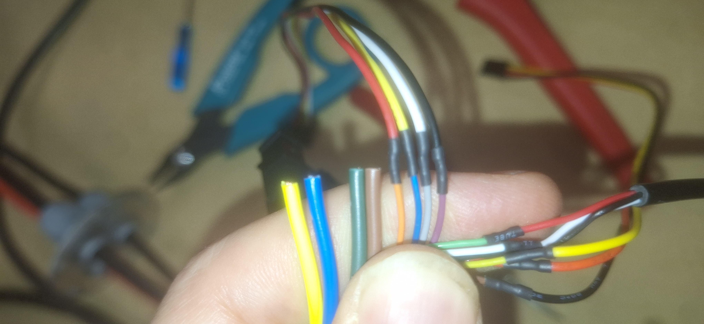

# Flipsky emotor controller wire colors

## Flipsky 65150 Motor 160KV 3000W IP68 BLDC Motor / ESC 2-in-1 Combo For Surfing Boat Underwater Thruster |Hydro | Efoil 

The uart coms uses the following wire colors:

- Yellow = original color orange to red
- blue = original color blue to yellow
- green = original color gray to white
- brown = original color purple to black

UART pin functions (original wire colors):

- Red: +5V (VCC) power out from ESC
- Yellow: RX on ESC (connect to your MCU/adapter TX)
- White: TX on ESC (connect to your MCU/adapter RX)
- Black: GND

Notes:

- Logic level is 3.3V UART; don’t drive ESC pins with 5V logic.
- Cross TX/RX when connecting to your device.

The usb uses the following wire colors:

- Black: GND
- Green: D+
- White: D-