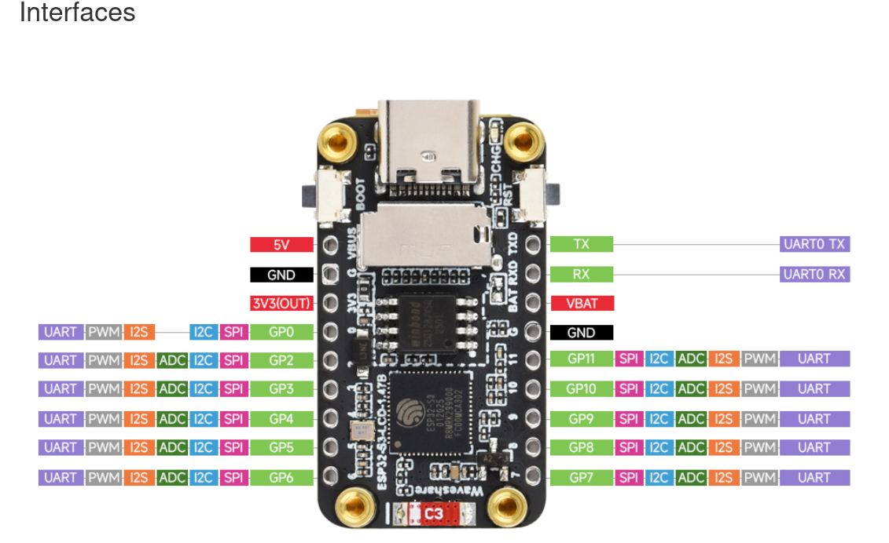

## ESP32-S3-LCD-1.47B

See the Waveshare wiki for details: [ESP32-S3-LCD-1.47B](https://www.waveshare.com/wiki/ESP32-S3-LCD-1.47B)

**Important:** Do not remove the screen when soldering the header pins. Tilt the iron and solder directly.

### Introduction

ESP32-S3-LCD-1.47B is a microcontroller development board with 2.4GHz Wi‑Fi and Bluetooth BLE 5. It integrates large‑capacity Flash and PSRAM and includes a 1.47" LCD capable of smoothly running GUI frameworks such as LVGL. With rich peripheral interfaces, it suits rapid HMI development and other ESP32‑S3 applications.

### Features

- Equipped with high‑performance Xtensa 32‑bit LX7 dual‑core processor, up to 240MHz
- 2.4GHz Wi‑Fi (802.11 b/g/n) and Bluetooth 5 (BLE), onboard antenna
- Built‑in 512KB SRAM, 384KB ROM, 8MB PSRAM, and 16MB Flash
- Onboard 1.47" LCD, 172×320 resolution, 262K color
- Adapts most GPIOs; integrates full‑speed USB serial port
- Onboard QMI8658 6‑axis IMU (3‑axis accelerometer + 3‑axis gyroscope)
- Onboard RGB light bead with acrylic light guide
- Onboard TF card slot for external storage
- Battery charging management module (battery connector at pin header area)
- Flexible clock and multiple power modes for low‑power scenarios

### Onboard Resources

1. ESP32‑S3R8 — dual‑core processor, up to 240MHz  
2. 16MB Flash  
3. RGB light bead — works with onboard acrylic for lighting effects  
4. ME6217C33M5G — LDO regulator, up to 800mA output  
5. QMI8658 — six‑axis gyro accelerometer  
6. Charging management circuit  
7. Patch ceramic antenna  
8. Battery header — 3.7V Li‑ion/Li‑Po, supports charge and discharge  
9. TF card slot  
10. RESET button  
11. BOOT button  
12. Type‑C interface — power, USB communication, firmware download

### Pinouts

**Left-Side Pins**  

| Pin Label | Functions |
|-----------|-----------|
| **5V** | 5V Power Input |
| **GND** | Ground |
| **3V3 (OUT)** | 3.3V Output |
| **GP0** | UART, PWM, I2S, I2C, SPI |
| **GP2** | UART, PWM, I2S, ADC, I2C, SPI |
| **GP3** | UART, PWM, I2S, ADC, I2C, SPI |
| **GP4** | UART, PWM, I2S, ADC, I2C, SPI |
| **GP5** | UART, PWM, I2S, ADC, I2C, SPI |
| **GP6** | UART, PWM, I2S, ADC, I2C, SPI |

**Right-Side Pins**  

| Pin Label | Functions |
|-----------|-----------|
| **TX** | UART0 TX |
| **RX** | UART0 RX |
| **VBAT** | Battery Input |
| **GND** | Ground |
| **GP11** | SPI, I2C, ADC, I2S, PWM, UART |
| **GP10** | SPI, I2C, ADC, I2S, PWM, UART |
| **GP9**  | SPI, I2C, ADC, I2S, PWM, UART |
| **GP8**  | SPI, I2C, ADC, I2S, PWM, UART |
| **GP7**  | SPI, I2C, ADC, I2S, PWM, UART |

LCD (ST7789 controller)

| Signal    | ESP32‑S3 GPIO |
|-----------|----------------|
| MOSI      | GPIO45         |
| SCLK      | GPIO40         |
| LCD_CS    | GPIO42         |
| LCD_DC    | GPIO41         |
| LCD_RST   | GPIO39         |
| LCD_BL    | GPIO46         |

RGB light bead

| Signal        | ESP32‑S3 GPIO |
|---------------|----------------|
| RGB_Control   | GPIO38         |

TF Card

| Signal | ESP32‑S3 GPIO |
|--------|----------------|
| SD_CMD | GPIO15         |
| SD_SCK | GPIO14         |
| SD_D0  | GPIO16         |
| SD_D1  | GPIO18         |
| SD_D2  | GPIO17         |
| SD_D3  | GPIO21         |

### Specifications

| Item                | Parameter                 |
|---------------------|---------------------------|
| Interface           | USB Type‑C                |
| Controller chip     | ESP32‑S3                  |
| LCD type            | TFT                       |
| LCD controller chip | ST7789 (display)          |
| Onboard devices     | RGB light bead            |
|                     | TF card slot              |
|                     | QMI8658 6‑axis IMU        |
|                     | Charging management IC    |

**Important:** Do not remove the screen when soldering the header pins. Tilt the iron and solder directly.

### Usage Instructions

ESP32‑S3‑LCD‑1.47B currently provides two development tools/frameworks: Arduino IDE and ESP‑IDF. Choose based on your project needs and personal preference.